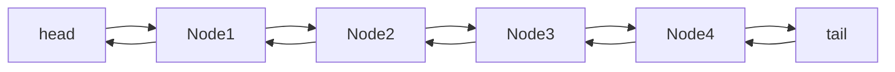

### week2-3

#### idea

- 追加、削除、検索がO(1)ということは大枠は hash table
- 順番を持たせたいので、linked list の要素を hash table の value にすることを考える

#### linked list

- key, value, next, prev を持つ node の繋がり
- 末尾の要素を削除したいので双方向リストにしている

#### cache

- hash_table, linked_list, size, page_count を持つ
- hash_table の key = url, value = node
- node の key = url, value = contents

**access_page**

- size > page_count の場合
  - linked_list の先頭に挿入
  - その先頭 node を hash_table に挿入
  - page_count を増やす
- size == page_count で、cache にない url の場合
  - linked_list の先頭に挿入
  - linked_list の末尾の node を cache から削除
  - 先頭 node を hash_table に挿入
- size == page_count で、cache にある url の場合
  - hash_table から url に対応する node を取得し、その node の prev と next を繋ぐ
  - hash_table から その要素を削除
  - linked_list の先頭に挿入
  - 先頭 node を hash_table に挿入

**get_pages**

- linked_list 中の node を順番に pages=[] に入れて返す
- 計算量は O(n) なので performance_test ではしていない
